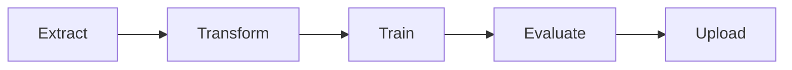

# Автоматизация ML-пайплайна с Apache Airflow и облачного хранилища

## Выполнил: Куриленко Сергей

## Оглавление

1. [Описание проекта](#описание-проекта)  
2. [Структура репозитория](#структура-репозитория)  
3. [Требования](#требования)  
4. [Настройка окружения](#настройка-окружения)  
   - [.env-файл](#env-файл)  
   - [Конфигурация пайплайна (config/config.yaml)](#конфигурация-пайплайна-configconfigyaml)  
5. [Развёртывание с Docker Compose](#развёртывание-с-docker-compose)  
6. [Ручной запуск ETL-скриптов](#ручной-запуск-etl-скриптов)  
7. [Описание пайплайна](#описание-пайплайна)  
   - [Mermaid-диаграмма](#mermaid-диаграмма)  
   - [Описание шагов](#описание-шагов)  
8. [Airflow DAG](#airflow-dag)  
9. [Интеграция с S3 и локальное сохранение](#интеграция-с-s3-и-локальное-сохранение)  
10. [Устойчивость и обработка ошибок](#устойчивость-и-обработка-ошибок)  
11. [Идеи для развития](#идеи-для-развития)  
12. [Скриншот работы](#скриншот-работы)  

---

## Описание проекта

**Тема:** Автоматизация и оркестрация пайплайна машинного обучения с использованием Apache Airflow и Amazon S3.

В этом проекте выстроен полностью воспроизводимый ETL-пайплайн:

1. **Extract** — загрузка и первичный анализ датасета _Breast Cancer Wisconsin Diagnostic_ из внешнего CSV.  
2. **Transform** — очистка, нормализация, подготовка признаков.  
3. **Train** — обучение модели `LogisticRegression`.  
4. **Evaluate** — расчёт метрик (Accuracy, Precision, Recall, F1).  
5. **Upload** — сохранение артефактов локально в `results/` и (опционально) выгрузка в S3.

Оркестрация выполняется через Airflow DAG, скрипты написаны на Python.

---

## Структура репозитория

```text
├── dags/
│   └── pipeline_dag.py         # DAG-описание
├── etl/
│   ├── extract.py              # загрузка данных
│   ├── transform.py            # препроцессинг
│   ├── train.py                # обучение модели
│   ├── evaluate.py             # вычисление метрик
│   └── upload.py               # сохранение + S3
├── config/
│   └── config.yaml             # единый конфиг пайплайна
├── results/                    # модель и метрики
├── logs/                       # логи ETL и Airflow
├── Dockerfile                  # сборка образа Airflow + deps
├── docker-compose.yaml         # развёртывание всех сервисов
├── requirements.txt            # Python-зависимости
├── .env                        # переменные окружения (AWS и др.)
└── README.md                   # эта документация
```

## Требования

* Docker ≥ 20.10, Docker Compose V2
* Python 3.8+ (для локального запуска скриптов)
* Учетная запись AWS S3 (bucket, ключи)

---

## Настройка окружения

### .env-файл

Создайте файл в корне проекта `.env` с содержимым:

```dotenv
# AWS S3 для выгрузки (если push_to_s3 = 1)
AWS_ACCESS_KEY_ID=ВАШ_KEY_ID
AWS_SECRET_ACCESS_KEY=ВАШ_SECRET
AWS_DEFAULT_REGION=us-west-2
```

Airflow-контейнеры подхватят эти переменные через

```yaml
env_file:
  - ./.env
```

### Конфигурация пайплайна (config/config.yaml)

```yaml
# Источник данных
source_url: "https://archive.ics.uci.edu/ml/machine-learning-databases/breast-cancer-wisconsin/wdbc.data"
# Пути
raw_data_path: "data/raw/wdbc.data"
processed_data_path: "data/processed/data.csv"
model_path: "data/model.pkl"
metrics_path: "data/metrics.json"
res_path: "results"
# Параметры модели
model:
  random_state: 42
  C: 1.0
push_to_s3: 0  # 1 для отправки в S3, 0 чтобы не отправлять
# Интеграция с S3
s3:
  bucket: "your-bucket-name"
  prefix: "etl-results"
```

---

## Развёртывание с Docker Compose

1. Клонируйте репозиторий и перейдите в папку:

   ```bash
   git clone https://github.com/ваш-пользователь/etl-airflow-project.git
   cd etl-airflow-project
   ```
2. Соберите и запустите стек:

   ```bash
   docker compose down
   docker compose up --build -d
   ```
3. Дождитесь, пока сервис `airflow-init` применит миграции и создаст учётку `airflow/airflow`.
4. Откройте UI Airflow на [http://localhost:8080](http://localhost:8080) и войдите:

   ```
   Username: airflow
   Password: airflow
   ```
5. Включите **pipeline\_dag** и нажмите ▶️ **Trigger Dag**.

---

## Ручной запуск ETL-скриптов

Для отладки можно запускать скрипты по-отдельности:

```bash
   python etl/extract.py   --config config/config.yaml
   python etl/transform.py --config config/config.yaml
   python etl/train.py     --config config/config.yaml
   python etl/evaluate.py  --config config/config.yaml
   python etl/upload.py    --config config/config.yaml
```

---

## Описание пайплайна

### Mermaid-диаграмма



### Описание шагов

1. **Extract**

   * Загружает CSV по `data_url`.
   * Сохраняет сырой файл и выводит базовую статистику.
2. **Transform**

   * Переименовывает колонки, удаляет ID.
   * Нормализует численные признаки через `StandardScaler`.
3. **Train**

   * Делит выборку на train/test.
   * Обучает `LogisticRegression(**model_params)`.
   * Сохраняет модель в `results/model.pkl`.
4. **Evaluate**

   * Предсказывает метки на тестовой выборке.
   * Считает метрики из `evaluate.metrics`.
   * Сохраняет `results/metrics.json`.
5. **Upload**

   * Всегда копирует файлы из `results/` локально.
   * При `push_to_s3 == 1` отправляет их в S3-бакет.

---

## Airflow DAG

* **Имя:** `pipeline_dag`
* **Расписание:** ежедневное (`schedule='@daily'`)
* **default\_args:**

  * `retries=3`, `retry_delay=timedelta(minutes=5)`
  * `owner='airflow'`

```python
    extract >> transform >> train >> evaluate >> upload
```

### Тестирование тасков

```bash
  docker compose exec airflow-webserver \
  airflow tasks test pipeline_dag extract 2025-06-15
```

---

## Интеграция с S3 и локальное сохранение

* **Авторизация** через AWS-переменные из `.env`.
* **Локально**: копируем модель и метрики в `results/`.
  * **S3** (при `push_to_s3=1`):

  ```python
    import boto3
    s3 = boto3.client('s3')
    s3.upload_file(str(local_path), bucket_name, key)
   ```

## Устойчивость и обработка ошибок

* Используются **retries** и `retry_delay` в Airflow.
* **Логирование** в каждом скрипте (модуль `logging`), логи сохраняются в `logs/`.
* **Валидация** формата данных в `extract` (проверка количества столбцов, типов).
* **Проверка наличия** файлов перед загрузкой в S3.
* При тайм-аутах/ошибках S3 — повторные попытки в `upload.py`.

---

## Идеи для развития

* Добавить **стратифицированный сплит** данных по пациентам.
* Расширить набор метрик: ROC AUC, PR AUC.
* Реализовать **кросс-валидацию** в отдельном таске.
* Интеграция с **Slack**/Email-уведомлениями.
* Масштабирование на **Kubernetes** или **Docker Swarm**.

## Скриншот работы


